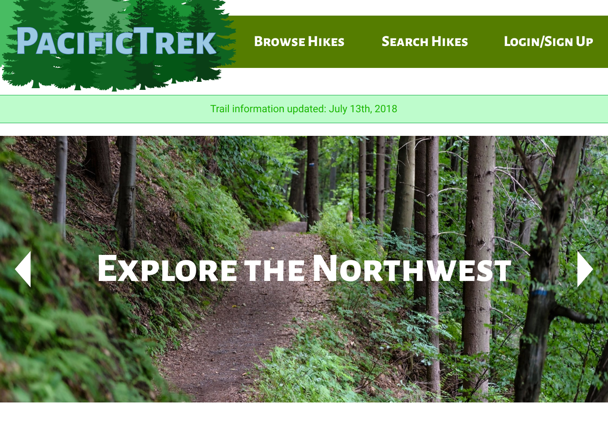
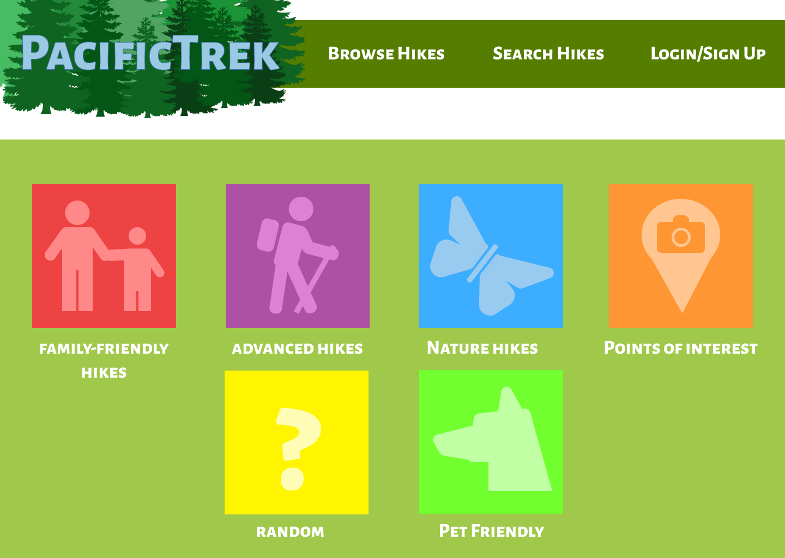
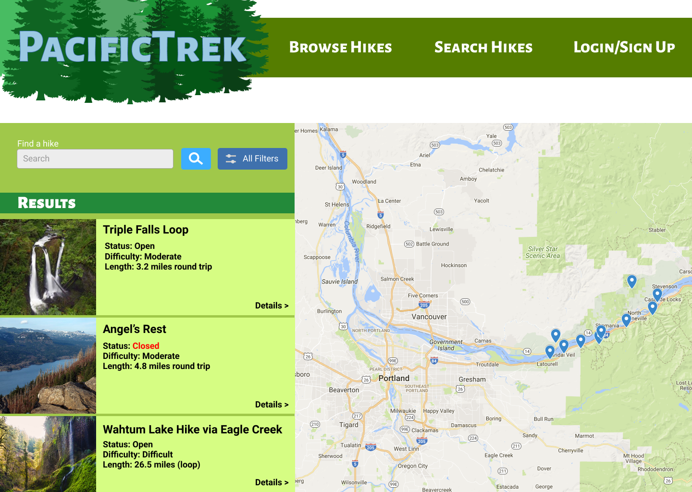
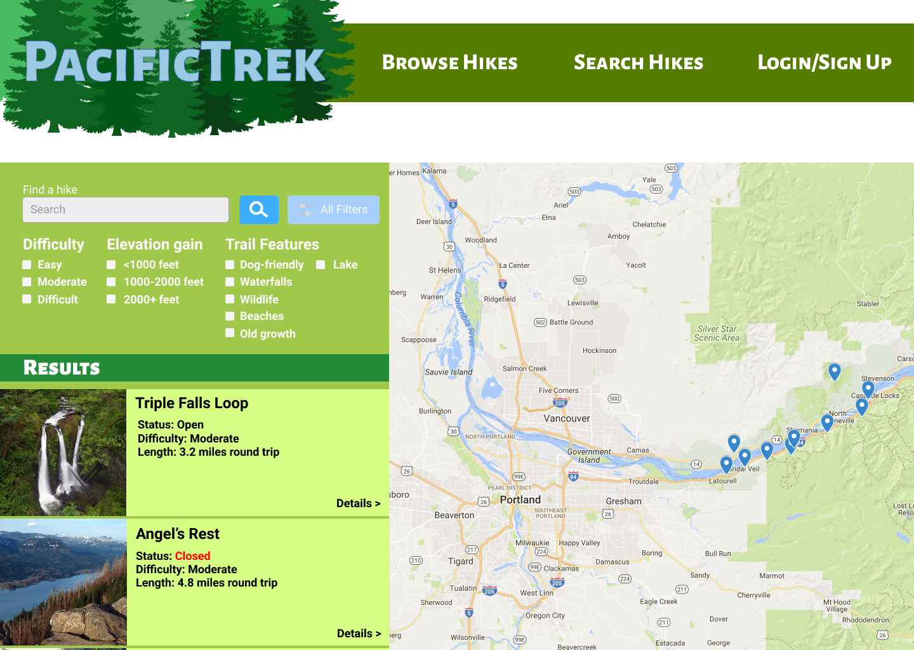

# PacificTrek - A hiking directory
### By Ami Cooper
---
### Table of Contents
1. [Description](#description)
2. [Wireframes](#wireframes)
3. [Project architecture](#components)
4. Tools and technologies
4. Installation and setup guide
5. Goals and process log
5. Credits and licenses

###  Project description
#### Welcome to PacificTrek, a field guide for hikers in the Pacific Northwest.
On this site, you can search through hike trails based on various features to create the perfect adventure, such as trail length and elevation gain, dog or children-friendly trails, or even natural features such as waterfalls or lakes.

The focus is to create a guide that's easy to use with a clean interface that allows you to get the information you need to have a fun and safe hike and get out there!

### Wireframes
*The wireframes are only a prototype and the final project is subject to change*

#### Desktop view
| The homepage| The browse page|
|---|---|
| The search page with the filters toggled closed| The search page with the filters toggled open|

### Project architecture
