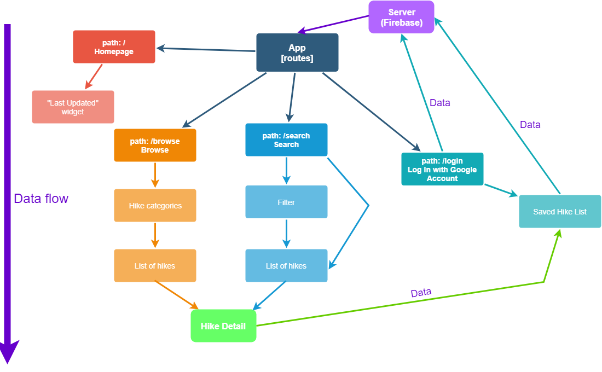

# PacificTrek - A hiking directory
### By Ami Cooper
---
### Table of Contents
1. [Description](#description)
2. [MVP and reach goals](#mvp)
2. [Wireframes](#wireframes)
3. [Project architecture](#components)
4. [Tools and technologies](#tools)
4. [Installation and setup guide](#setup)
5. Project Log
5. Credits and licenses

###  Project description
#### Welcome to PacificTrek, a field guide for hikers in the Pacific Northwest.
On this site, you can search through hike trails based on various features to create the perfect adventure, such as trail length and elevation gain, dog or children-friendly trails, or even natural features such as waterfalls or lakes.

The focus is to create a guide that's easy to use with a clean interface that allows you to get the information you need to have a fun and safe hike and get out there!

###  MVP and Reach goals
|MVP|Reach Goals|
|--|--|
| - Hike objects are displayed on the search page and are filterable by checkbox/text input criteria | - User login (via Google accounts)|
| - Hike detail pages with dynamic routing | - Google maps for trailheads |
| --- | Comment/rating system for each hike |
| --- | Administrative ability from site (edit database without directly editing through Firebase)|

### Wireframes
*The wireframes are only a prototype and the final project is subject to change*

#### Desktop view
| The homepage| The browse page|
|---|---|
| The search page with the filters toggled closed| The search page with the filters toggled open|

### Project architecture

### Tools and technologies
* NodeJs
* HTML/CSS
* React
* Firebase
* Google Maps

### Installation and setup instructions
#### For users:
Simply visit the website [url goes here]

#### For developers:
##### Note: You must have your own database and corresponding API key from Firebase or the project will not have any data.
1. Clone repository from [https://github.com/amiraine/pacific-trek.git]
2. Navigate to the project directory in your terminal and run `npm install`
3. Go to your Firebase database and upload `./src/assets/hikelist.json`.
4. Navigate to `src/constants/` and create a file called `firebaseConfig.js`
5. Inside of the firebaseConfig.js file, add the following:
  `const config = {
    apiKey: "YOUR-UNIQUE-CREDENTIALS",
    authDomain: "YOUR-PROJECT-NAME.firebaseapp.com",
    databaseURL: "https://YOUR-PROJECT-NAME.firebaseio.com",
    projectId: "YOUR-UNIQUE-PROJECT-NAME",
    storageBucket: "YOUR-UNIQUE-URL",
    messagingSenderId: "YOUR-UNIQUE-CREDENTIALS"
  };`
5. For a live development server with hot-module replacement, run `npm start` in your terminal.

###  Project Log
7/13/17 13:30pm working on setting up a firebase, made JSON for project directory

###  Credits and licenses
##### This project was developed as a capstone for Epicodus by Ami Cooper
##### It is licensed under the Mozilla Public License 2.0
